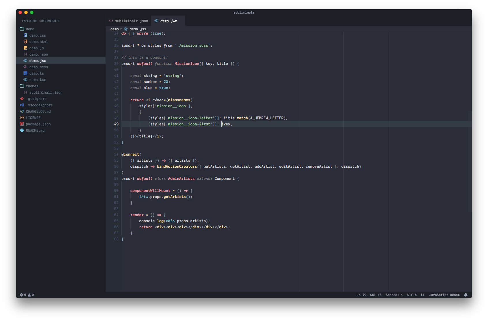

# SubliminalR

Inspired by the Subliminal theme this reloaded version has some extended language support
and some personal preferences.

_Icon theme: Material Theme Icons Ocean, Font: [Dank Mono](https://dank.sh)_

See the [CHANGELOG](CHANGELOG.md) for the latest changes.

## Usage

Select the theme and you are ready to go!

## Installation

1.  Open Extensions sidebar panel in VS Code. View → Extensions
1.  Search for `SubliminalR`
1.  Click Install
1.  Click Reload
1.  File > Preferences > Color Theme > SubliminalR
1.  Optional: Use the settings below for a better and more minimalistic experience

## Feedback / Issues

Do you like the theme? Don't hesitate to share your thoughts!

Let me know, if you'd like to see any specific synytax added by creating a [Github issue](https://github.com/tobiastimm/subliminalr/issues).

## Author

[Tobias Timm](https://twitter.com/TbsTimm)

## License

MIT
